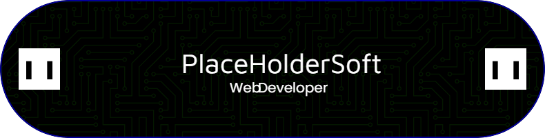

# ¡Hola! 👋 ¿Qué tal?

  

---

## 📌 Tabla de Contenidos

📍 [Sobre Mí](#sobre-mí)  
📍 [Tecnologías](#tecnologías)  
📍 [📊 Estadísticas](#estadísticas)  
📍 [🚀 Proyectos Destacados](#proyectos-destacados)  
📍 [📬 Contacto](#contacto)  

---

## 👨‍💻 Sobre Mí

¡Hola! Soy **PlaceHolderSoft**, un desarrollador apasionado por la tecnología y la programación. Me especializo en crear soluciones eficientes y escalables.

- 🔭 Actualmente trabajando en proyectos personales.  
- 🌱 Aprendiendo nuevas tecnologías y mejores prácticas de desarrollo.  
- ⚡ Dato curioso: ¡Me encanta aprender cosas nuevas!

---

## 🚀 Tecnologías

  
  
  
  
  
  
  

---

## 📊 Estadísticas

  
  

---

## 🚀 Proyectos Destacados

### 🔹 Proyecto 1: [ContaApp](https://github.com/nullpoint-Software/despachoapp-vue)

Aplicación diseñada para la gestión y control eficiente de tareas en un despacho contable, desarrollada con Vue 3, Tailwind CSS y PrimeVue para una experiencia intuitiva y moderna.

---

## 📬 Contacto

  
  

